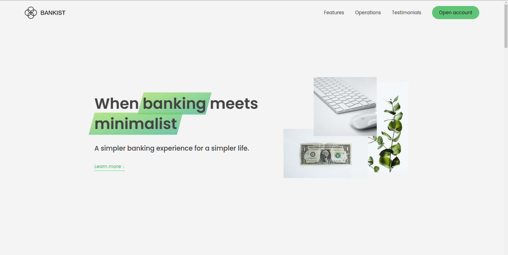

# Web-Projects

This repository showcases the web projects I developed during the JavaScript course on Udemy. These projects cover a range of topics, including DOM manipulation, event handling, asynchronous programming, and interactive UI elements. Using HTML, CSS, and JavaScript, I applied key concepts to build functional and engaging web applications. This collection serves as both a learning journey and a reference for future projects.

## Bank App

## Banksite App

